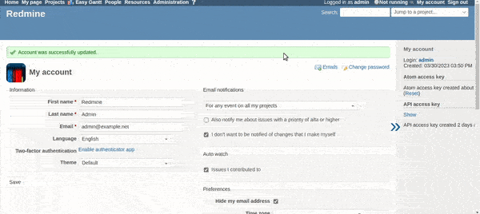

# Toggle the display of the sidebar

Toggle the display of the sidebar.
The default is to show it.  
サイドバーの表示・非表示を切り替え可能にします。
表示するパターンです。

### Improvements made

* Increase button size for better viewing
* Changed to be open by default (can be changed in code if preferred)
* Added effect when opening/closing the sidebar
* Button set to a position that adapts to different themes
* Button accompanies page scrolling
* When clicking on the button the page is no longer moved to the top (it is kept in the same position as the page scrolls)

## Setting

### Path Pattern

None

### Insert Position

Head of all pages
<!-- 
Head of all pages
Bottom of issue form
Bottom of issue detail
Bottom of all pages
-->

### Code

JavaScript
<!--
JavaScript
CSS
HTML
-->

```javascript
$(function() {

  const toggleButton = $('<a id="sidebar_button" href="#"></a>')
    .css({
      'display': 'block',
      'font-size': '50px',
      // Altere a posição de 'absolute' para 'fixed' para adicionar a funcionalidade de rolagem
      'position': 'fixed',
      'top': '300px',
      'left': '-30px'
    });

  const wrapper = $('<div></div>')
    .append(toggleButton)
    .css({
      'float': 'right',
      'margin-left': '-0px',
    });

  const sidebar = $('#sidebar').prepend(wrapper);

  // Adiciona um contêiner dentro da barra lateral e define sua largura para um valor fixo
  const container = $('<div></div>')
    .css({
      'width': '300px'
    })
    .append(sidebar.children().not(wrapper));

  sidebar.append(container);

  let isOpen = false; // Altere para true para iniciar a barra lateral aberta por padrão

  const updateButtonPosition = function() {
    toggleButton.css('left', `${sidebar.offset().left - toggleButton.outerWidth() - -14}px`);
  }

  const toggle = function(event) {
    // Adicione uma verificação para garantir que o objeto event está definido antes de chamar preventDefault
    // Isso evitará que a página role para cima quando o botão for clicado
    if (event) {
      event.preventDefault();
    }
    
    isOpen = !isOpen;

    if (isOpen) {
      // close -> open
      toggleButton.html('»');

      sidebar.animate({
        width: '15%',
        paddingRight: '0'
      }, {
        duration: 500,
        step: updateButtonPosition
      });

      wrapper.nextAll().show();

    } else {
      // open -> close
      toggleButton.html('«');

      sidebar.animate({
        width: '0%',
        paddingRight: '0'
      }, {
        duration: 500,
        step: updateButtonPosition
      });

      wrapper.nextAll().hide();
    }
  }

  toggleButton.on('click', toggle);

  // default open
  toggle();

  $(window).on('resize', updateButtonPosition);
});
```

## Result


